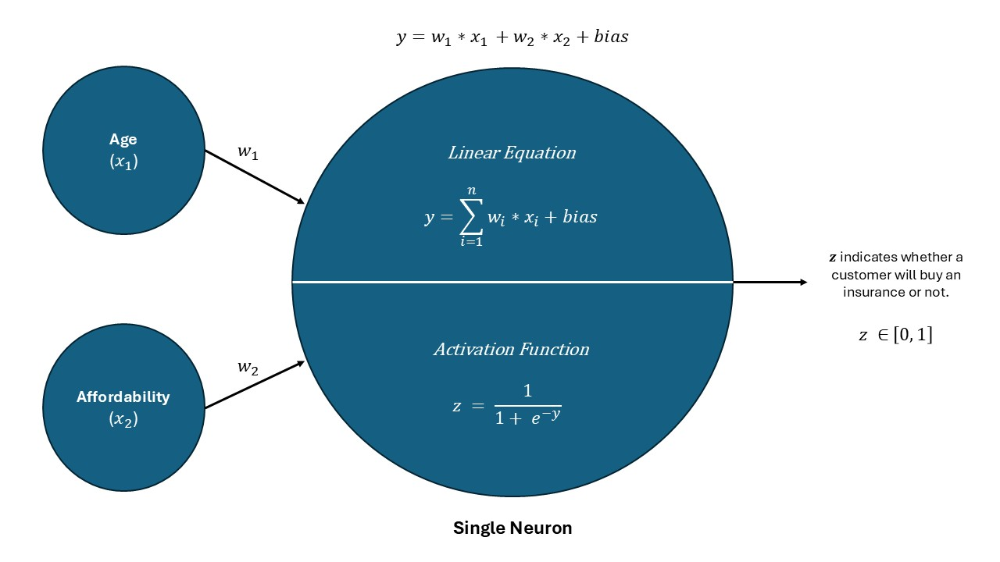
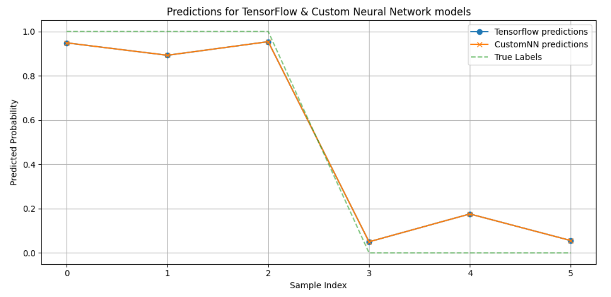

# 🧠 Neural Network from Scratch — Logistic Regression with Custom Gradient Descent

This project implements a **single-neuron Neural Network (similar to logistic regression)** completely from scratch using NumPy, and then compares it with TensorFlow's implementation to verify correctness and performance. The goal is to deeply understand forward propagation, loss calculation, backpropagation, and gradient descent by hand-coding everything without relying on high-level libraries.

## Snippet of Explanation

---

## 📚 Overview

In this notebook, you'll find:

- Manual implementation of a neural network with 1 neuron (i.e., logistic regression)
- Custom forward pass using the sigmoid activation
- Custom backpropagation using binary cross-entropy loss
- Gradient descent to update weights and bias
- Training loop with accuracy and loss tracking
- Visual comparison of predictions from the custom model vs. the TensorFlow model
- 3D plot of predicted probabilities based on input features
  

## 📬 Sections include:

- Dataset overview and explanation
- TensorFlow benchmark model
- Custom sigmoid and log loss functions
- `CustomNN` class (manual training using gradient descent & backward error propagation)
- Prediction and evaluation logic
- Matplotlib plots to visualize model performance
  

## 🧠 Model Details

### Custom Model (`CustomNN`)
- **Input Features**: Age, Affordibility 
- **Architecture**: 1 Neuron with sigmoid activation
- **Loss Function**: Binary Cross Entropy (log loss)
- **Optimizer**: Vanilla Gradient Descent
- **Metrics**: Loss, Accuracy
- **Learning Rate**: Configurable (default `0.5`)
- **Early Stopping**: Based on loss threshold
  

### TensorFlow Model (for comparison)
- Same architecture and initialization
- `Dense(1, activation="sigmoid")` with `weights=1`, `bias=0`
- Same learning rate and optimizer (`SGD`)
  

## 📊 Results

- Final weights and bias from both models match exactly ✅
- Accuracy and loss progress shown every 50 epochs ✅
- 2D plots of predictions reveal similar decision boundaries ✅

## 📈 Visualizations

**Line Plot** comparing predictions of both models and ground truth labels

## 📌 Summary
This notebook isn't just about building a model — it's about understanding how models actually learn. If you can build a neural network from scratch, everything in deep learning becomes less intimidating and more intuitive.

